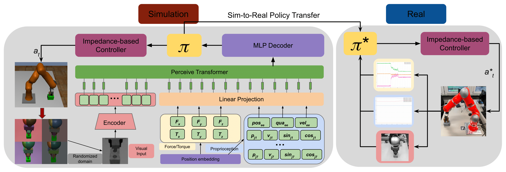

# Multi-Modality Driven Impedance-Based Sim2Real Transfer Learning for Robotic Multiple Peg-in-Hole Assembly

- **Quick Demos**

https://user-images.githubusercontent.com/42525310/213158994-87d3be1c-2106-4f7b-859c-4e609fed3c9a.mp4

## Installation

* Run `conda create -n dynamic-assembly python=3.8.13 && conda activate dynamic-assembly` to create and activate a new python environment.
* Install [MuJoCo](https://mujoco.org/) using these [instructions](https://github.com/hietalajulius/mujoco-py/tree/8131d34070e684705990ef25e5b3f211e218e2e4#install-mujoco) (i.e. extract the downloaded `mujoco210` directory into ~/.mujoco/mujoco210)
* Use [obj2mjcf](https://github.com/kevinzakka/obj2mjcf) to process original robot urdf file  and assembly-related object file into XML file for the use in [MuJoCo](https://mujoco.org/).
* Run `cd dynamic-assembly && ./install-dependencies.sh` to install all required dependencies.

## Training a Pretrained Vision model
* Collect a dataset from different hole/peg shapes during raw policy learning based on the [ShuffleNet-v2](https://arxiv.org/abs/1807.11164) perception. An example dataset of circle shape can be obtained `https://drive.google.com/drive/folders/181-17Ub87fH-swqxKHRSpU4iK7TywIp7?usp=drive_link`.
* The pretarining framework is designed from simple [VAE models](https://github.com/AntixK/PyTorch-VAE). You can test the collected dataset based on these models. 

## Construction of Simulation Environment
* Modified from the [robosuite](https://robosuite.ai/docs/overview.html), we use our own Kuka_iiwa robot and self-designed peg/hole objects to execute the assembly task. Model files are in `robosuite/models` and the assembly environment settings in  `robosuite/enviroments`.
* The manipulation of robot model and robot controllers are based on the [MujocoPy](https://github.com/openai/mujoco-py).

## Visualization of training process
* Install the package of Viskit from [rllab](https://github.com/rll/rllab).

## Our Network module from SAC algorithm
* Install our modified rlkit package from [rlkit](https://github.com/rail-berkeley/rlkit).

## Updating...