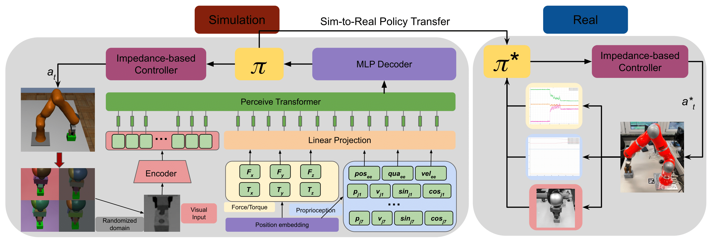

# Multi-Modality Driven Impedance-Based Sim2Real Transfer Learning for Robotic Multiple Peg-in-Hole Assembly

- **Quick Demos**

https://user-images.githubusercontent.com/42525310/213158994-87d3be1c-2106-4f7b-859c-4e609fed3c9a.mp4

## Installation

* Run `conda create -n dynamic-assembly python=3.8.13 && conda activate dynamic-assembly` to create and activate a new python environment.
* Install [MuJoCo](https://mujoco.org/) using these [instructions](https://github.com/hietalajulius/mujoco-py/tree/8131d34070e684705990ef25e5b3f211e218e2e4#install-mujoco) (i.e. extract the downloaded `mujoco210` directory into ~/.mujoco/mujoco210)
* Use [obj2mjcf] to process original urdf file into XML file for thr use in [MuJoCo](https://mujoco.org/).
* Run `cd dynamic-assembly && ./install-dependencies.sh` to install all required dependencies.